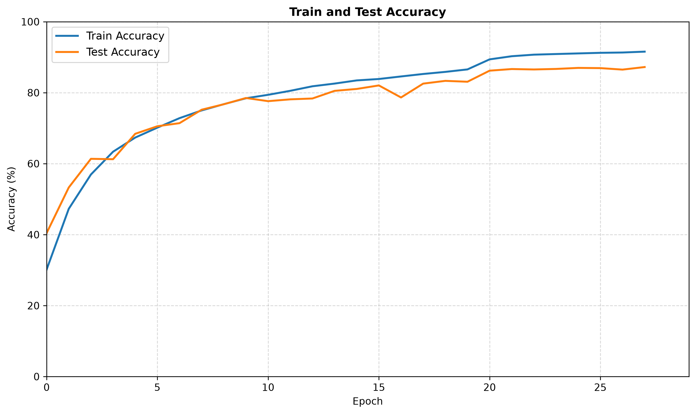
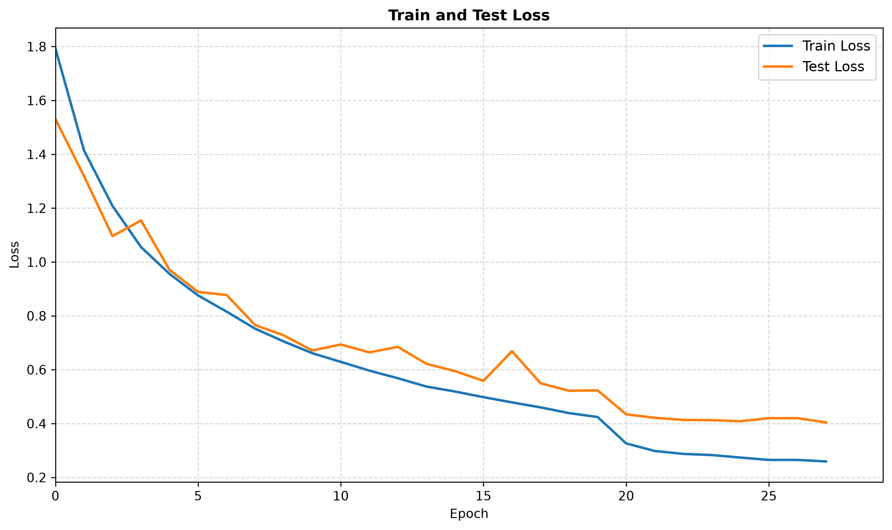
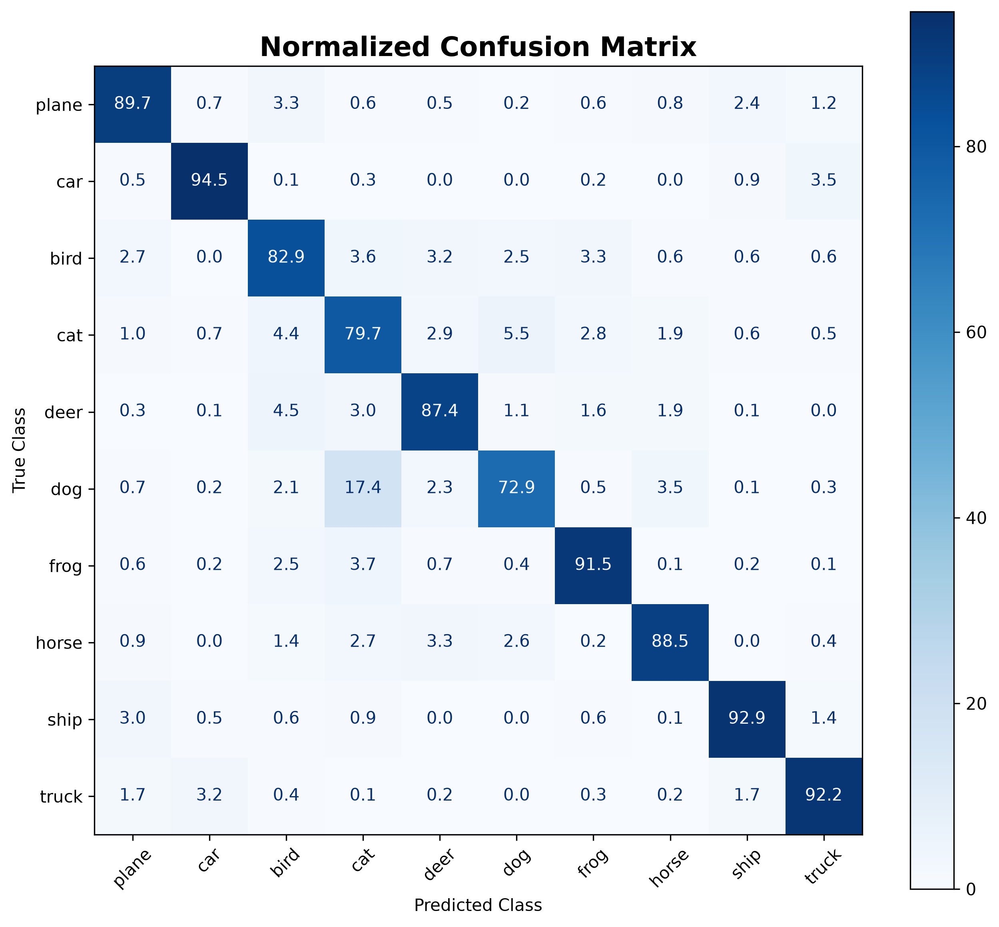
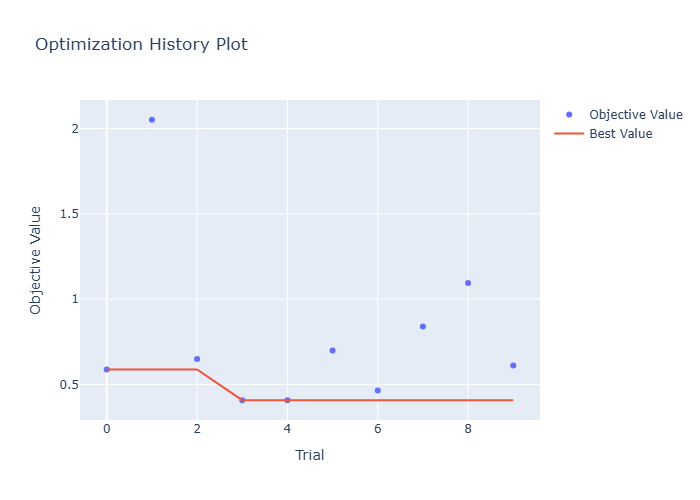

# CIFAR-10 Image Classification using Dynamic CNN + Optuna

## Overview

A PyTorch-based CNN classifier for CIFAR-10 with automated hyperparameter optimization using Optuna.

The model architecture is dynamically generated based on:
- Number of convolution layers
- Number of filters
- Optimizer
- Learning rate
- Batch size

---

## Features

- Custom CNN architecture
- Data augmentation
- GPU training support
- Optuna hyperparameter search
- Confusion matrix evaluation
- Automated experiment tracking

---

## Model

Dynamic CNN:

Input:
32x32 RGB image

Convolution blocks:
- Conv2D
- BatchNorm
- ReLU
- MaxPooling

Classifier:
Fully connected layer

---

## Hyperparameters Optimized

| Parameter | Search Space |
|-|-|
| Learning rate | 1e-5 - 1e-2 |
| Batch size | 64,128,256 |
| Optimizer | Adam, SGD, RMSprop |
| Conv layers | 2-6 |
| Filters | 32,64,128 |

---

## Results

### Accuracy



### Loss



### Confusion Matrix



### Optuna Optimization



---

## Installation

```bash
pip install -r requirements.txt
